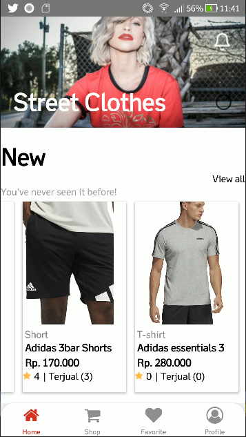
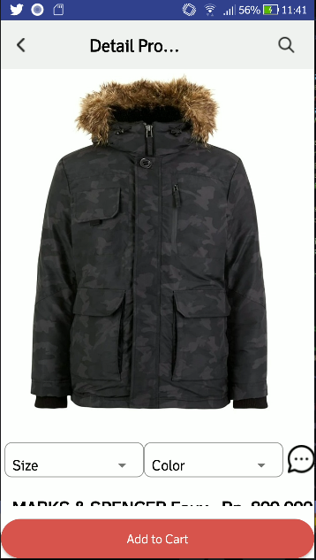
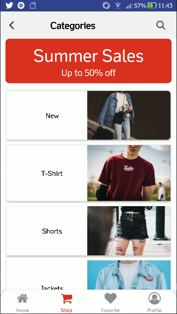
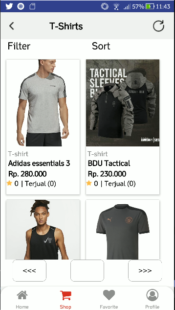
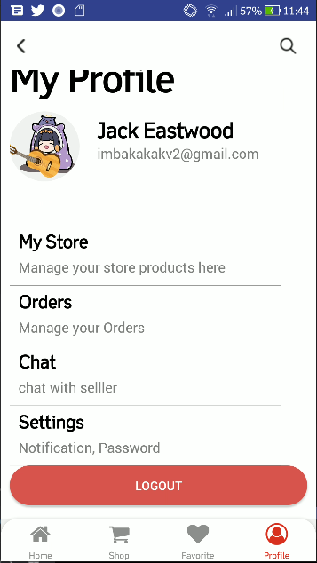

# Blanja Mobile App 

  

<div  align="center">


</div>

  

## Contents

  

-  [Description](#description)

-  [Features](#features)

-  [Requirements](#requirements)

-  [Installation](#installation)

-  [Screenshoots](#screenshoots)

-  [Download](#demo-blanja-web)

-  [Related Project](#related-project)

  

## Description

  

**Blanja** is a mobile e-commerce application that allows buyers to order products of their choice. Users consist of 2 types of roles, which is buyers and sellers.

  

## Features

  
- Browse product
- Order product
- History transaction
- Add product (sellers only)
- Edit product (sellers only)
- Private chat between buyers and sellers
- Edit profile
- etc

  

## Requirements

  

-  [`Node Js`](https://nodejs.org/en/)

-  [`npm`](https://www.npmjs.com/get-npm)

-  [`ReactNative`](https://reactjs.org/)

-  [`Blanja Backend`](https://github.com/agungl4/blanja-REST-revamped.git)

  

## Installation

  

1. Open your terminal or command prompt

2. Type `git clone https://github.com/agungl4/blanjaRN.git`

3. Open the folder and type `npm install` for install dependencies

4. Create file **_.env_** in root directory with the following contents :

  

```bash

REACT_APP_BASE_URL = "http://host_backend:port_backend"

```

Example :
- http://host_backend:port_backend is http://localhost:8000

so, you can write in .env file like this :

```bash

REACT_APP_BASE_URL = "http://localhost:8000"

```


5. Before install this application, you must install the backend and then run it

6. Install the apk into your device or emulator.


## Screenshoots

  

<div  align="center">











</div>

  

## Download

  

This is Blanja Mobile App build version, download here.

  

<a  href="https://drive.google.com/file/d/1ARLZM0IZZ8Ur7XV_eE4Qg8TTjUL_4Wjg/view?usp=sharing">


</a>

  

## Related Project

  

RESTful API for this mobile application, clone this for development.

  

<a  href="https://github.com/agungl4/blanja-REST-revamped.git">


</a>
